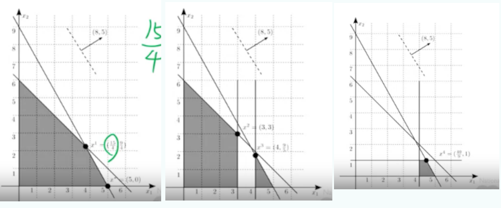

# Pesquisa Operacional II
## Otimização Inteira (Aula 2 - Algoritmo Branch and Bound)

Prof. M.Sc. Diego Ascânio Santos (ascanio@cefetmg.br)

Aula baseada sobre o material do professores Dr. João Fernando Machry Sarubbi (joao@cefetmg.br - DECOM), Fernando Nogueira e vídeoaulas do curso de algoritmos de pesquisa operacional da Universidade Nacional de Taiwan.

Belo Horizonte, 2023.

---

Roteiro

<ol>
  <li>Introdução</li>
  <li>Algoritmo Branch and Bound</li>
  <ul>
    <li>Relaxação Linear</li>
    <li>Conceito do particionamento (branch) e limitação (bound)</li>
  </ul>
  <li>Solução de problemas de programação inteira usando Branch and Bound</li>
  <li>Modelagem de problemas de programação inteira e solução com algoritmo branch and bound</li>
</ol>

---

<!-- _class: lead -->
# Introdução

---

Porque estudar o Algoritmo Branch and Bound.

Porque quase nunca os arredondamentos para números das soluções do SIMPLEX para programação inteira produzem soluções factíveis ou ótimas, bem como, pelo custo exponencial (\(n^m, n!\)) para verificação de soluções pelo algoritmo de força bruta é que precisamos de soluções computacionalmente mais eficientes para resolver problemas de programação inteira.

 

Destarte, os algoritmos branch-and-bound (particiona e delimita) e de planos de corte são alternativas que oferecem maior eficiência computacional. Na aula de hoje, veremos o algoritmo branch-and-bound.

---

<!-- _class: lead -->
# Algoritmo Branch and Bound

---

Relaxação Linear

<ul>
<li>Arredondar soluções obtidas pelo método SIMPLEX não garante que encontraremos soluções ótimas;</li>
<li>Testar todas as combinações de números inteiros possíveis (através de força bruta) torna-se inviável em problemas de 13 ou mais variáveis </li>
<li>De qualquer forma, até o momento o simplex é o único método eficiente que conhecemos para resolver problemas de programação linear </li>
</ul>
 

É possível aproveitarmos benefícios do SIMPLEX na resolução de problemas inteiros?

---

Relaxação Linear

É possível aproveitarmos benefícios do SIMPLEX na resolução de problemas inteiros?

 

Sim é possível. O passo mais óbvio é o da realização da RELAXAÇÃO LINEAR, que consiste em retirar do problema original, as restrições que obrigam que as variáveis de decisão sejam inteiras.

 

---

Relaxação Linear

Mas, aí Bottini, voltamos ao problema original do simplex, de produzir variáveis fracionadas que ao serem arredondadas não produzem soluções ótimas ao problema!

---

Relaxação Linear

Mas, aí Bottini, voltamos ao problema original do simplex, de produzir variáveis fracionadas que ao serem arredondadas não produzem soluções ótimas ao problema!

PORÉM, ENTRETANTO, CONTUDO E TODAVIA: SE EM VEZ DE ARREDONDARMOS OS VALORES DAS VARIÁVEIS, ENCONTRARMOS FORMAS DE SUBDIVIDIR AS REGIÕES DO NOSSO PROBLEMA PARA APLICAR RECURSIVAMENTE O SIMPLEX SOBRE ELAS ATÉ ENCONTRARMOS SOLUÇÕES CANDIDATAS QUE SEJAM INTEIRAS, SEREMOS CAPAZES DE ENCONTRAR UMA SOLUÇÃO ÓTIMA AO NOSSO PROBLEMA?

<b>SIM, SEREMOS!</b>

---

Relaxação Linear

<b>Porquê seremos capazes?</b>

Porque as relaxações lineares produzem limites superiores --- em problemas de maximização --- e inferiores --- em problemas de minimização --- que encapsulam as soluções factíveis (e ótimas) dos problemas de programação inteira originais. Com isso, ao estabelecermos estes limites, garantimos que a solução ótima do problema de programação inteira também está presente na região factível do subproblema de programação linear relaxado (ver aula do coursera, universidade de Taiwan). 

---

---

Relaxação Linear

Diante disso, nossa missão se resume a apenas uma:

Quais intervenções devemos fazer para criar quantos programas lineares relaxados forem necessários no entorno do nosso conjunto de soluções inteiras candidatas do nosso problema de PI para que ao menos um destes programas relaxados --- se nosso PI original admitir solução --- produza também a solução ótima do nosso PI?

---

<!-- _class: lead -->
# A essas intervenções, damos o nome de algoritmo Branch (particiona) and Bound (delimita)

---

Algoritmo Branch and Bound

O algoritmo tem este nome porque consiste em sucessivas partições (branches) usadas para "quebrar" as regiões de um problema de programação inteira em múltipas subpartes até que uma destas subpartes apresente variáveis candidatas inteiras que maximizem a função objetivo desejada.

Entretanto, não podemos quebrar os (sub) problemas à revelia, pois, poderiamos realizar inúmeras subdivisões e nunca encontrar nossa solução final. Assim, é necessário estabelecer critérios de limitação (parada) das execuções - bounding.

---

<!-- _class: lead -->
# Branch and Bound - Funcionamento

---

<video src="./1.mp4" controls="controls" width=100%>
</video>

---

<video src="./2.mp4" controls="controls" width=100%>
</video>

---

<video src="./3.mp4" controls="controls" width=100%>
</video>

